# 🏫 SPESIFIKASI DIAGRAM & CONTEXT SISTEM KANTIN DIGITAL (MERMAID MASTER)

Dokumen ini dirancang sebagai **Text Prompt Master** yang sangat detail untuk diberikan kepada AI Diagram Builder (seperti ChatGPT, Claude, Gemini, atau Mermaid Live Editor). Dokumen ini membantu AI memahami **konteks bisnis, arsitektur backend, dan logika alur kerja** sebelum merancang atau merapikan ke-11 diagram sistem menggunakan Mermaid.js agar selaras, konsisten, dan memiliki visual premium.

---

## 🏛️ PART 1: PENJELASAN KONTEKS & WORKFLOW SISTEM

Sistem Kantin Digital adalah platform transaksi cashless (non-tunai) di lingkungan sekolah untuk memudahkan siswa melakukan pembelian di kantin menggunakan kartu RFID/NFC (Tap-to-Pay) sebagai pengganti uang tunai. Sistem ini dibangun dengan arsitektur modern menggunakan teknologi Flutter dan Supabase Cloud.

### 👥 Aktor Utama & Hak Akses (Roles)
Sistem memiliki 5 aktor dengan peran dan batasan hak akses yang jelas:
1. 👦 **Siswa** (Role: `siswa` | Warna Visual: Biru 🔵 `#DAE8FC`)
   - Memegang kartu fisik RFID/NFC untuk melakukan transaksi tap jajan di kantin.
   - Login ke Mobile App Siswa untuk melihat sisa saldo, memantau riwayat transaksi jajan secara detail, dan menerima push notification real-time.
2. 👩 **Orang Tua** (Tanpa Login | Warna Visual: Biru 🔵 `#DAE8FC`)
   - Mengakses Web Publik khusus orang tua menggunakan NIS (Nomor Induk Siswa) anak.
   - Dapat melihat saldo saat ini, 5 riwayat transaksi terakhir anak, dan melakukan top-up online.
3. 👵 **Petugas Kantin / Kasir** (Role: `petugas_kantin` | Warna Visual: Kuning/Peach 🟡 `#FFE6CC`)
   - Penjual stan makanan di kantin sekolah.
   - Login ke Mobile POS App (Point of Sale) untuk mengelola katalog menu jajan, menginput keranjang belanja (cart) siswa, melakukan scan kartu NFC siswa, memotong saldo, dan memproses checkout jajan.
4. 👨‍💼 **Admin Keuangan / Koperasi** (Role: `admin_keuangan` | Warna Visual: Hijau 🟢 `#D5E8D4`)
   - Petugas tata usaha atau koperasi sekolah yang mengurusi administrasi kas tunai.
   - Login ke Web Admin Portal untuk melayani top-up manual/tunai (menerima uang tunai fisik dan menginput saldo ke akun siswa) serta melakukan koreksi/penyesuaian saldo jika ada kesalahan input.
5. 👑 **Super Admin** (Role: `super_admin` | Warna Visual: Teal/Abu-abu `#E6F2F2`)
   - Pengelola sistem tingkat tertinggi (Dinas Pendidikan atau Kepala Sekolah).
   - Memiliki akses penuh ke seluruh data sekolah, CRUD akun pengguna, dan memantau live audit logs untuk melacak semua perubahan data administratif sensitif.

---

### ⚡ Alur Transaksi Utama & Validasi Keamanan (Anti-Fraud & ACID)
Untuk mencegah eksploitasi keamanan (seperti modifikasi saldo lokal di sisi aplikasi client), sistem menerapkan validasi transaksi yang ketat di sisi server (Server-side Validation):
1. **Penyusunan Belanja**: Petugas Kantin memasukkan makanan/minuman ke keranjang di aplikasi POS Kasir -> Total harga dihitung secara lokal di client.
2. **Scan NFC**: Siswa men-tap kartu RFID/NFC ke HP kasir (atau card reader) -> POS App membaca UID kartu NFC dan mengirimkannya ke Supabase Database.
3. **Cek Saldo Aktual**: Database mengembalikan nama siswa dan saldo teraktual yang ada di server. POS App melakukan verifikasi awal: jika saldo kurang, transaksi dibatalkan langsung.
4. **Eksekusi Transaksi (ACID Stored Procedure)**: Jika saldo cukup, POS App mengirim request checkout berupa daftar item belanja beserta total harga ke Supabase.
5. **Server-Side Validation**: Database Supabase akan memproses transaksi ini dalam sebuah database transaction yang bersifat atomik (all-or-nothing):
   - Database menarik harga aktual produk langsung dari tabel `products` di server (bukan mempercayai nominal harga yang dikirim oleh POS App client) untuk mencegah manipulasi harga belanja di client.
   - Database melakukan pengecekan ulang apakah saldo siswa di tabel `students` benar-benar cukup.
   - Database memotong saldo siswa (`balance` - total_harga) dan mencatat transaksi ke tabel `transactions` & `transaction_items`.
   - Rantai aksi ini dibungkus dalam ACID Transaction, jika salah satu langkah gagal, seluruh transaksi di-rollback secara otomatis.
6. **Notifikasi Real-time**: Jika transaksi sukses, database memicu trigger push notification melalui Firebase Cloud Messaging (FCM) dan Supabase Realtime Channel untuk langsung mengirimkan pesan instan jajan ke HP Siswa/Orang Tua secara real-time.

---

### 💳 Alur Top-Up Saldo (Online vs Manual)
Sistem mendukung dua metode top-up saldo jajan:
1. **Jalur Online (Midtrans Payment Gateway)**:
   - Siswa atau Orang Tua memilih nominal top-up di aplikasi.
   - Aplikasi memanggil Midtrans Snap SDK untuk melakukan pembayaran online (Virtual Account, QRIS, dll).
   - Setelah pembayaran berhasil, Midtrans mengirimkan webhook HTTP ke Supabase Edge Functions.
   - Edge Functions memvalidasi tanda tangan webhook, mengupdate saldo siswa di database secara aman, dan mengirim notifikasi push sukses.
2. **Jalur Manual (Cash di Koperasi - Audit-Logged)**:
   - Siswa menyerahkan uang tunai ke koperasi sekolah.
   - Admin Keuangan memverifikasi NIS siswa, lalu menginput nominal top-up tunai melalui Web Admin Portal.
   - Sistem memperbarui saldo siswa di database, sekaligus **wajib mencatat entri log secara otomatis ke tabel `audit_logs`** (berisi ID admin, NIS target, nominal sebelum dan sesudah top-up, IP Address admin, dan timestamp).
   - **Pencegahan Korupsi**: Tabel `audit_logs` diatur menggunakan RLS (Row Level Security) Supabase agar berstatus *Insert-Only*. Tidak ada admin, termasuk Admin Keuangan, yang dapat mengedit atau menghapus log audit ini, sehingga Super Admin memiliki rekam jejak keuangan yang 100% transparan dan tidak dapat dimanipulasi.

---

### 🗄️ Konsistensi Model Data (Class & Database Schema)
Nama kelas perangkat lunak pada Class Diagram (PascalCase) berkorespondensi satu-satu dengan nama tabel fisik database pada ERD (snake_case):
- `User` 👤 <=> `users`: Akun login utama pengguna (`id`, `email`, `password_hash`, `full_name`, `role`, `is_active`, `created_at`).
- `School` 🏫 <=> `schools`: Profil sekolah mitra (`id`, `name`, `address`, `logo_url`, `is_active`, `created_at`).
- `Student` 🎓 <=> `students`: Profil siswa pemegang kartu NFC (`id`, `user_id`, `school_id`, `nis`, `balance`, `card_uid`, `is_card_frozen`, `is_active`).
- `CanteenOperator` 🏪 <=> `canteen_operators`: Operator stan penjual di kantin (`id`, `user_id`, `school_id`, `stall_name`, `is_active`).
- `Product` 🍔 <=> `products`: Produk menu jajan yang dijual stan (`id`, `canteen_operator_id`, `name`, `price`, `image_url`, `is_available`).
- `Transaction` 💸 <=> `transactions`: Log transaksi masuk/keluar keuangan (`id`, `student_id`, `type`, `amount`, `performed_by`, `method`, `status`, `notes`, `created_at`).
- `TransactionItem` 🧾 <=> `transaction_items`: Item detail belanja dalam transaksi jajan (`id`, `transaction_id`, `product_id`, `name`, `price`, `quantity`, `subtotal`).
- `AuditLog` 📜 <=> `audit_logs`: Rekaman audit aktivitas sensitif admin (`id`, `user_id`, `action`, `target_table`, `target_id`, `old_value`, `new_value`, `ip_address`, `created_at`).

---

## 📊 PART 2: SOURCE CODE MERMAID SECARA DETIL (11 DIAGRAM)

### 🗺️ 01. Activity Diagram (Alur Kerja Operasional)
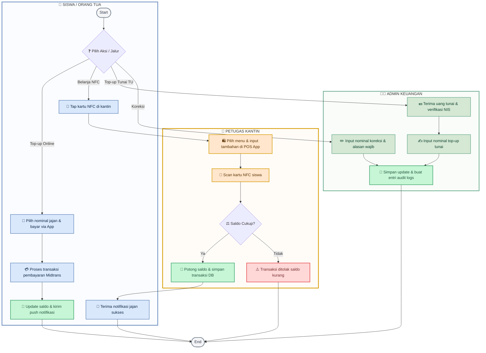

---

### 📐 02. Class Diagram (Struktur Objek Logis)
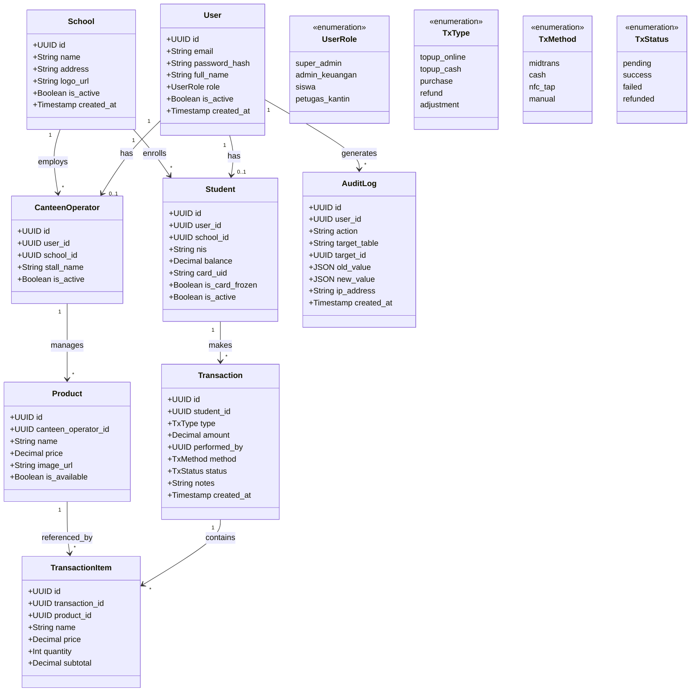

---

### 🗄️ 03. ER Diagram (Skema Database PostgreSQL)
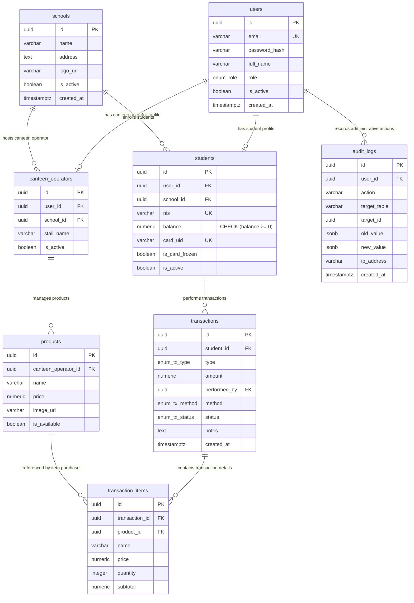

---

### 🔄 04. Sequence Diagram (Validasi Tap Transaksi NFC)
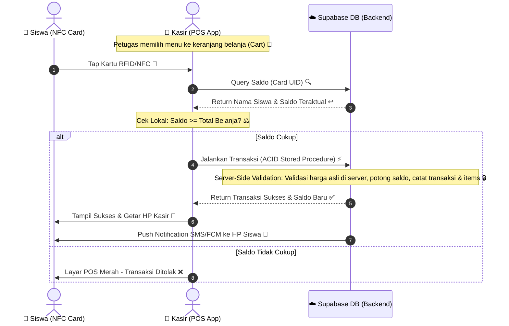

---

### 📅 05. Timeline (Roadmap Agile 6 Minggu)
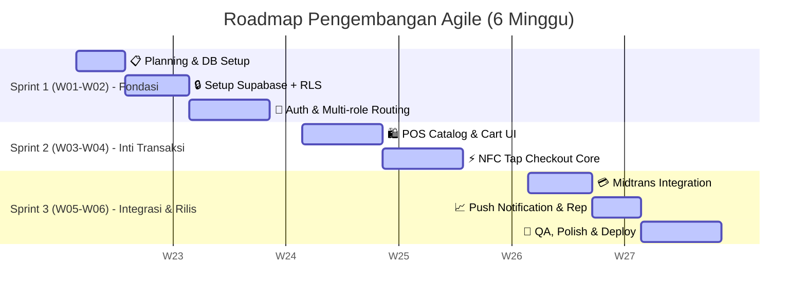

---

### 🎭 06. Use Case Diagram
```mermaid
flowchart LR
    classDef siswa fill:#DAE8FC,stroke:#6C8EBF,color:#0A2540,stroke-width:2px
    classDef petugas fill:#FFE6CC,stroke:#D79B00,color:#5A3200,stroke-width:2px
    classDef admin fill:#D5E8D4,stroke:#72B095,color:#0A3F2C,stroke-width:2px
    classDef super fill:#E6F2F2,stroke:#0E8A8A,color:#0A3F2C,stroke-width:2px
    classDef uc fill:#1e293b,stroke:#94a3b8,color:#f1f5f9,stroke-width:1px

    style boundary fill:#0f172a,stroke:#475569,stroke-width:2px,stroke-dasharray: 5 5

    subgraph Actors ["👥 AKTOR"]
        Siswa["👦 Siswa"]:::siswa
        Ortu["👩 Orang Tua"]:::siswa
        Petugas["👵 Petugas Kantin"]:::petugas
        Admin["👨‍💼 Admin Keuangan"]:::admin
        Super["👑 Super Admin"]:::super
    end

    subgraph boundary ["💻 SISTEM KANTIN DIGITAL (SYSTEM BOUNDARY)"]
        UC1(["🔑 Login & Autentikasi"]):::uc
        UC2(["📊 Cek Saldo & Histori Jajan"]):::uc
        UC3(["💳 Top-up Online Midtrans"]):::uc
        UC4(["❄️ Link & Freeze Kartu NFC"]):::uc
        UC5(["🛒 POS Checkout Belanja"]):::uc
        UC6(["🥗 Kelola Menu Stan CRUD"]):::uc
        UC7(["💵 Top-up Tunai Manual"]):::uc
        UC8(["✏️ Koreksi Saldo Manual"]):::uc
        UC9(["🏫 CRUD Data Siswa & Operator"]):::uc
        UC10(["📜 Monitoring Live Audit Log"]):::uc
    end

    Siswa --> UC1 & UC2 & UC3 & UC4
    Ortu --> UC2 & UC3
    Petugas --> UC1 & UC2 & UC5 & UC6
    Admin --> UC1 & UC7 & UC8 & UC9
    Super --> UC1 & UC9 & UC10
```

---

### 🌐 07. Context Diagram (DFD Level 0)
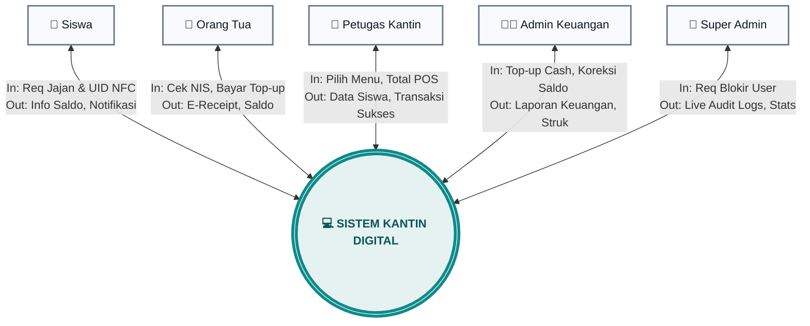

---

### 🏗️ 08. Architecture Diagram (Tingkat Arsitektur)
```mermaid
flowchart TD
    classDef clSiswa fill:#DAE8FC,stroke:#6C8EBF,color:#0A2540,stroke-width:2px
    classDef clKasir fill:#FFE6CC,stroke:#D79B00,color:#5A3200,stroke-width:2px
    classDef clAdmin fill:#D5E8D4,stroke:#72B095,color:#0A3F2C,stroke-width:2px
    classDef clEsp fill:#E2E8F0,stroke:#64748B,color:#0F172A,stroke-width:2px
    classDef sb fill:#E6F2F2,stroke:#0E8A8A,color:#0c5757,stroke-width:2px
    classDef sbDb fill:#115E59,stroke:#0D9488,color:#FFFFFF,stroke-width:2px,font-weight:bold
    classDef tp fill:#F3E8FF,stroke:#8B5CF6,color:#5B21B6,stroke-width:2px

    style ClientTier fill:#0f172a,stroke:#3b82f6,stroke-width:1px,stroke-dasharray: 5 5
    style BackendTier fill:#0f172a,stroke:#0d9488,stroke-width:1px,stroke-dasharray: 5 5
    style ThirdPartyTier fill:#0f172a,stroke:#8b5cf6,stroke-width:1px,stroke-dasharray: 5 5

    subgraph ClientTier ["📱 CLIENT TIER (Aplikasi & Perangkat Keras)"]
        AppSiswa["📱 Siswa App\n(Flutter Mobile)"]:::clSiswa
        AppKasir["🛒 Petugas POS App\n(Flutter Mobile / NFC)"]:::clKasir
        AppAdmin["💻 Admin Web Portal\n(Flutter Web Desktop)"]:::clAdmin
        ESP32["⚙️ ESP32 Hardware\n(RFID RC522 Reader)"]:::clEsp
    end

    subgraph BackendTier ["☁️ BACKEND TIER (Supabase Cloud Services)"]
        Auth["🔑 Supabase Auth\n(Identity & Access)"]:::sb
        Func["⚡ Edge Functions\n(Midtrans Webhook)"]:::sb
        Realtime["🔔 Realtime Channel\n(Live Notif Push)"]:::sb
        DB[("🗄️ PostgreSQL DB\n12 Tabel + RLS Security")]:::sbDb
    end

    subgraph ThirdPartyTier ["💳 THIRD PARTY INTEGRATION TIER"]
        Midtrans["💳 Midtrans Payment\nGateway"]:::tp
        FCM["📡 Firebase Cloud\nMessaging (FCM)"]:::tp
    end

    AppSiswa -->|HTTPS Auth| Auth
    AppKasir -->|NFC Checkout| DB
    AppAdmin -->|REST API| DB
    ESP32 -->|HTTP POST| DB
    Auth -->|ACID Update| DB
    Midtrans -->|Webhook Callback| Func
    Func -->|Trigger Trigger| DB
    DB -->|Trigger push| FCM
    FCM -->|Notify API| Realtime
    Realtime -->|Receive WS| AppSiswa
```

---

### 🔄 09. Agile Development Method (Scrum Flow)
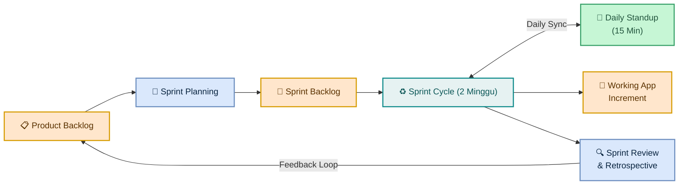

---

### 🗺️ 10. System Features Map (Mindmap Fitur)
```mermaid
flowchart TD
    classDef root fill:#E6F2F2,stroke:#0E8A8A,color:#0c5757,stroke-width:3px,font-weight:bold
    classDef siswa fill:#DAE8FC,stroke:#6C8EBF,color:#0A2540,stroke-width:2px
    classDef petugas fill:#FFE6CC,stroke:#D79B00,color:#5A3200,stroke-width:2px
    classDef admin fill:#D5E8D4,stroke:#72B095,color:#0A3F2C,stroke-width:2px
    classDef leaf fill:#F8FAFC,stroke:#CBD5E0,color:#2D3748,stroke-width:1px

    Root(("🌟 FITUR UTAMA KANTIN DIGITAL")):::root

    Siswa["👦 Modul Siswa (Mobile)"]:::siswa
    Kantin["👵 Modul Kasir (Mobile)"]:::petugas
    Admin["👨‍💼 Admin Sekolah (Web)"]:::admin
    Master["👑 Master Admin (Web)"]:::admin
    Ortu["👩 Orang Tua (Web)"]:::siswa

    Root --> Siswa & Kantin & Admin & Master & Ortu

    S1["📊 Cek Saldo & Histori"]:::leaf
    S2["💳 Top-up Midtrans QRIS"]:::leaf
    S3["❄️ Freeze Kartu NFC"]:::leaf
    S4["⚙️ Profil & Ubah Sandi"]:::leaf
    Siswa --> S1 & S2 & S3 & S4

    K1["🛍️ POS Katalog Belanja"]:::leaf
    K2["✍️ Charge & Catatan"]:::leaf
    K3["📲 Tap NFC Checkout"]:::leaf
    K4["🥗 CRUD Menu & Stok"]:::leaf
    Kantin --> K1 & K2 & K3 & K4

    A1["💵 Top-up Tunai Koperasi"]:::leaf
    A2["✏️ Adjust Saldo & Audit Log"]:::leaf
    A3["🔗 Link UID USB Reader"]:::leaf
    A4["📈 Laporan Keuangan"]:::leaf
    Admin --> A1 & A2 & A3 & A4

    M1["🏫 CRUD Data Sekolah Mitra"]:::leaf
    M2["📜 Live Audit Logs Monitor"]:::leaf
    M3["🚫 Jam Malam / Blokir Akun"]:::leaf
    Master --> M1 & M2 & M3

    O1["👁️‍🗨️ Pantau Jajan NIS Anak"]:::leaf
    O2["⚡ Top-up Instan Tanpa Login"]:::leaf
    Ortu --> O1 & O2
```

---

### 🛣️ 11. Workflow Navigation (Screen Sitemap)
```mermaid
flowchart TD
    classDef siswa fill:#DAE8FC,stroke:#6C8EBF,color:#0A2540,stroke-width:2px
    classDef petugas fill:#FFE6CC,stroke:#D79B00,color:#5A3200,stroke-width:2px
    classDef admin fill:#D5E8D4,stroke:#72B095,color:#0A3F2C,stroke-width:2px
    classDef scr fill:#1e293b,stroke:#475569,color:#f1f5f9,stroke-width:1px

    style SiswaApp fill:#0f172a,stroke:#3b82f6,stroke-width:1px,stroke-dasharray: 5 5
    style PetugasApp fill:#0f172a,stroke:#f59e0b,stroke-width:1px,stroke-dasharray: 5 5
    style AdminPortal fill:#0f172a,stroke:#10b981,stroke-width:1px,stroke-dasharray: 5 5

    subgraph SiswaApp ["🔵 SISWA APP (MOBILE)"]
        S_LOGIN["🔑 Login Screen"]:::scr --> S_DASH["🏠 Dashboard (Home)"]:::scr
        S_DASH --> S_TOP["🔢 Top-up Nominal Grid"]:::scr
        S_TOP --> S_SNAP["🌐 Midtrans Snap Webview"]:::scr
        S_DASH --> S_HIST["📜 History List Screen"]:::scr
        S_DASH --> S_PROF["👤 Account Profile Screen"]:::scr
    end

    subgraph PetugasApp ["🟡 PETUGAS APP (MOBILE)"]
        K_LOGIN["🔑 Login Kasir"]:::scr --> K_POS["🛍️ POS Catalog Grid"]:::scr
        K_POS --> K_CART["🛒 Cart & Custom Charge"]:::scr
        K_CART --> K_NFC["📡 NFC Payment Modal"]:::scr
        K_POS --> K_CRUD["🥗 Menu Management (CRUD)"]:::scr
        K_POS --> K_CEK["🔍 Cek Saldo Saja Screen"]:::scr
    end

    subgraph AdminPortal ["🟢 ADMIN WEB PORTAL"]
        A_LOGIN["🔑 Web Login Portal"]:::scr --> A_DASH["📊 Dashboard Summary"]:::scr
        A_DASH --> A_TOP["💵 Top-up Tunai (TU)"]:::scr
        A_DASH --> A_ADJ["✏️ Koreksi Saldo Form"]:::scr
        A_DASH --> A_AUD["📜 Audit Logs Viewer"]:::scr
        A_DASH --> A_USER["🪪 Manage Siswa & Kartu"]:::scr
    end
```
