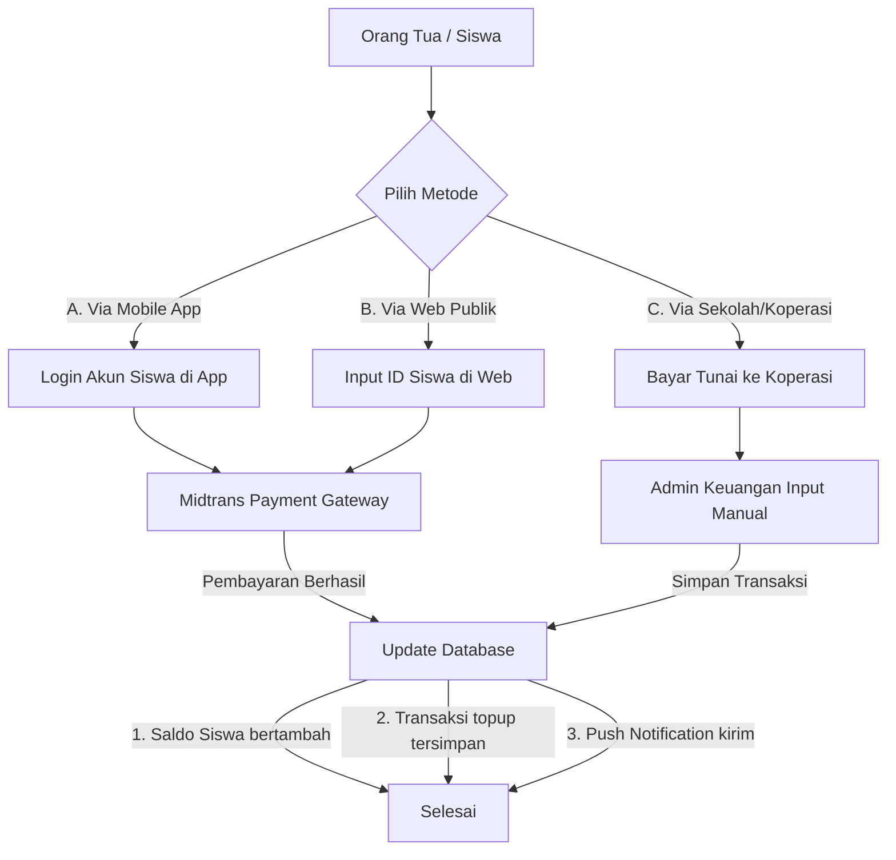
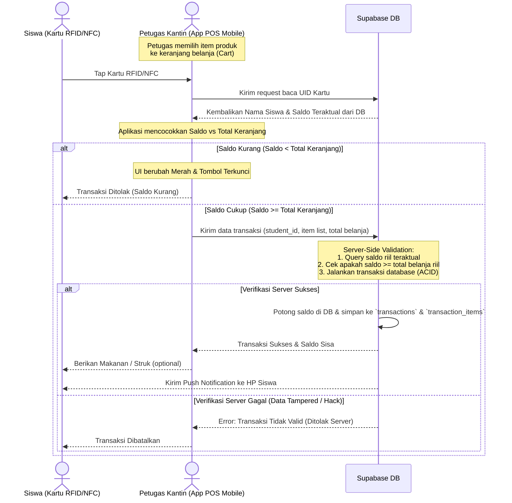

# 🔄 Alur Sistem (Flow) — Sistem Kantin Digital

Dokumen ini menjelaskan alur kerja utama (workflow) dari sistem kantin digital, termasuk top-up saldo, transaksi di kantin, dan pencatatan audit log untuk mencegah penyalahgunaan.

---

## 4.1 Alur Top-Up Saldo

Top-up saldo siswa dapat dilakukan melalui tiga jalur berbeda sesuai dengan kebutuhan orang tua dan siswa:



### Penjelasan Detil Jalur Top-up:
1. **Via Mobile App**: Siswa atau orang tua login ke aplikasi, pilih nominal top-up, dan melakukan pembayaran instan di dalam app menggunakan Midtrans (E-Wallet, VA Bank, QRIS).
2. **Via Web Publik (Orang Tua)**: Orang tua mengakses situs web top-up tanpa login, memasukkan ID Siswa (NIS/Student ID Code), memverifikasi nama siswa yang muncul, lalu membayar via Midtrans.
3. **Via Guru/Koperasi (Tunai)**: Siswa membawa uang tunai ke koperasi sekolah atau guru penanggung jawab. Admin Keuangan menerima uang tunai dan menginput top-up secara manual ke sistem melalui Web Admin.

---

## 4.2 Alur Transaksi di Kantin

Transaksi di kantin dirancang agar berjalan sangat cepat dan memiliki validasi saldo berlapis di sisi database server untuk mencegah kecurangan (hacking saldo lokal di client).



> [!CAUTION]
> **Pencegahan Manipulasi Saldo (Anti-Hacking)**:
> Aplikasi client (HP Petugas) **tidak diizinkan** melakukan kalkulasi sisa saldo lalu menyimpannya langsung ke database. Data saldo akhir siswa dihitung sepenuhnya di database server (Supabase PostgreSQL) melalui ACID transaction/stored procedure. Jika data input dari client telah dimanipulasi (misalnya total belanja dikirim lebih murah dari harga riil produk), server akan memvalidasi ulang harga produk dari tabel `products` di backend sebelum memotong saldo. Tabel `students` juga dilengkapi constraint `CHECK (balance >= 0)` untuk menjamin saldo tidak akan pernah menjadi negatif secara tidak sah.

---

## 4.3 Alur Anti-Korupsi & Transparansi (Audit Logs)

Untuk meminimalkan manipulasi saldo oleh Admin Keuangan, setiap perubahan saldo secara manual (di luar payment gateway otomatis) harus dicatat dengan ketat.

```mermaid
graph TD
    Admin[Admin Keuangan] -->|Melakukan Aksi Manual<br/>Topup Tunai / Koreksi Saldo| Action[Sistem Proses Aksi]
    Action --> DB[Update Saldo Siswa]
    Action --> Audit[Simpan Entri di Audit Logs]
    
    Audit -->|Catat detail| LogDetails[
      - Siapa yang melakukan (Admin ID)
      - Kapan (Timestamp)
      - Aksi apa (topup / deduct)
      - Nominal perubahan
      - Siswa target (NIS/ID)
      - IP Address & Device Info
      - Nilai Sebelum vs Sesudah (JSONB)
    ]
    
    LogDetails --> View[Super Admin Monitoring]
    View -->|Tinjau real-time| Alert[Cegah & Deteksi Penyimpangan]
```

> [!IMPORTANT]
> **Row Level Security (RLS)** di Supabase akan dikonfigurasi agar Petugas Kantin dan Admin Keuangan tidak bisa mengedit data tabel `audit_logs`. Tabel ini hanya bersifat *insert-only* bagi sistem dan *read-only* bagi Super Admin.
