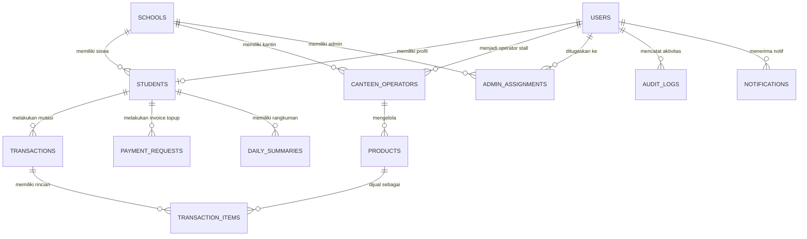

# 🗄️ Database Schema — Sistem Kantin Digital

Dokumen ini mendefinisikan skema database PostgreSQL (Supabase) yang digunakan untuk menyimpan data pengguna, sekolah, transaksi, audit logs, dan konfigurasi lainnya.

---

## 5.1 Skema Tabel (SQL DDL)

### 1. `users`
Tabel utama untuk semua pengguna yang memiliki hak login ke sistem.
```sql
CREATE TYPE user_role AS ENUM ('super_admin', 'admin_keuangan', 'siswa', 'petugas_kantin');

CREATE TABLE users (
    id UUID PRIMARY KEY DEFAULT gen_random_uuid(),
    email VARCHAR(255) UNIQUE NOT NULL,
    password_hash VARCHAR(255) NOT NULL,
    full_name VARCHAR(255) NOT NULL,
    role user_role NOT NULL,
    phone VARCHAR(20),
    avatar_url VARCHAR(255),
    is_active BOOLEAN DEFAULT true,
    created_at TIMESTAMP WITH TIME ZONE DEFAULT timezone('utc'::text, now()) NOT NULL,
    updated_at TIMESTAMP WITH TIME ZONE DEFAULT timezone('utc'::text, now()) NOT NULL
);
```

### 2. `schools`
Mendukung multi-sekolah untuk pengembangan jangka panjang (scalability).
```sql
CREATE TABLE schools (
    id UUID PRIMARY KEY DEFAULT gen_random_uuid(),
    name VARCHAR(255) NOT NULL,
    address TEXT,
    logo_url VARCHAR(255),
    phone VARCHAR(20),
    is_active BOOLEAN DEFAULT true,
    created_at TIMESTAMP WITH TIME ZONE DEFAULT timezone('utc'::text, now()) NOT NULL,
    updated_at TIMESTAMP WITH TIME ZONE DEFAULT timezone('utc'::text, now()) NOT NULL
);
```

### 3. `students`
Detail informasi siswa, dihubungkan ke `users` dan berisi saldo serta UID kartu RFID/NFC.
```sql
CREATE TABLE students (
    id UUID PRIMARY KEY DEFAULT gen_random_uuid(),
    user_id UUID REFERENCES users(id) ON DELETE CASCADE,
    school_id UUID REFERENCES schools(id) ON DELETE RESTRICT,
    student_id_code VARCHAR(50) UNIQUE NOT NULL, -- ID unik misal: KD-2026-XXXX
    nis VARCHAR(50) UNIQUE NOT NULL,             -- Nomor Induk Siswa
    class VARCHAR(50),                           -- Contoh: 7A, 8B, 9C
    card_uid VARCHAR(100) UNIQUE,                -- UID dari kartu RFID/NFC (NULL jika belum link)
    balance DECIMAL(12,2) DEFAULT 0.00 NOT NULL CHECK (balance >= 0),
    is_active BOOLEAN DEFAULT true,
    created_at TIMESTAMP WITH TIME ZONE DEFAULT timezone('utc'::text, now()) NOT NULL,
    updated_at TIMESTAMP WITH TIME ZONE DEFAULT timezone('utc'::text, now()) NOT NULL
);
```

### 4. `transactions`
Catatan lengkap mengenai mutasi saldo siswa baik top-up, belanja, refund, maupun koreksi manual.
```sql
CREATE TYPE tx_type AS ENUM ('topup', 'purchase', 'refund', 'adjustment');
CREATE TYPE tx_method AS ENUM ('cash', 'midtrans', 'bank_transfer', 'manual');
CREATE TYPE tx_status AS ENUM ('pending', 'success', 'failed', 'cancelled');

CREATE TABLE transactions (
    id UUID PRIMARY KEY DEFAULT gen_random_uuid(),
    student_id UUID REFERENCES students(id) ON DELETE RESTRICT NOT NULL,
    type tx_type NOT NULL,
    amount DECIMAL(12,2) NOT NULL CHECK (amount > 0),
    balance_before DECIMAL(12,2) NOT NULL,
    balance_after DECIMAL(12,2) NOT NULL,
    description TEXT,
    performed_by UUID REFERENCES users(id) ON DELETE RESTRICT NOT NULL,
    method tx_method NOT NULL,
    reference_id VARCHAR(100), -- ID dari Midtrans / payment gateway jika ada
    status tx_status DEFAULT 'pending' NOT NULL,
    created_at TIMESTAMP WITH TIME ZONE DEFAULT timezone('utc'::text, now()) NOT NULL,
    updated_at TIMESTAMP WITH TIME ZONE DEFAULT timezone('utc'::text, now()) NOT NULL
);
```

### 5. `canteen_operators`
Informasi tambahan untuk pengguna yang berperan sebagai penjual di kantin.
```sql
CREATE TABLE canteen_operators (
    id UUID PRIMARY KEY DEFAULT gen_random_uuid(),
    user_id UUID REFERENCES users(id) ON DELETE CASCADE NOT NULL,
    school_id UUID REFERENCES schools(id) ON DELETE RESTRICT NOT NULL,
    stall_name VARCHAR(100) NOT NULL, -- Nama warung / stan kantin
    is_active BOOLEAN DEFAULT true,
    created_at TIMESTAMP WITH TIME ZONE DEFAULT timezone('utc'::text, now()) NOT NULL,
    updated_at TIMESTAMP WITH TIME ZONE DEFAULT timezone('utc'::text, now()) NOT NULL
);
```

### 6. `admin_assignments`
Relasi penugasan Admin Keuangan ke sekolah tertentu.
```sql
CREATE TABLE admin_assignments (
    id UUID PRIMARY KEY DEFAULT gen_random_uuid(),
    user_id UUID REFERENCES users(id) ON DELETE CASCADE NOT NULL,
    school_id UUID REFERENCES schools(id) ON DELETE RESTRICT NOT NULL,
    role_detail VARCHAR(100), -- Keterangan tambahan, misal 'Bendahara 1'
    is_active BOOLEAN DEFAULT true,
    created_at TIMESTAMP WITH TIME ZONE DEFAULT timezone('utc'::text, now()) NOT NULL,
    updated_at TIMESTAMP WITH TIME ZONE DEFAULT timezone('utc'::text, now()) NOT NULL
);
```

### 7. `audit_logs`
Log audit mutlak untuk melacak setiap aksi yang memengaruhi saldo secara manual demi mencegah manipulasi.
```sql
CREATE TABLE audit_logs (
    id UUID PRIMARY KEY DEFAULT gen_random_uuid(),
    user_id UUID REFERENCES users(id) ON DELETE SET NULL, -- Admin yang melakukan
    school_id UUID REFERENCES schools(id) ON DELETE SET NULL,
    action VARCHAR(100) NOT NULL,  -- Contoh: 'topup_manual', 'koreksi_saldo'
    target_type VARCHAR(50) NOT NULL, -- Contoh: 'students', 'transactions'
    target_id UUID NOT NULL,
    old_value JSONB,
    new_value JSONB,
    ip_address VARCHAR(45),
    user_agent TEXT,
    created_at TIMESTAMP WITH TIME ZONE DEFAULT timezone('utc'::text, now()) NOT NULL
);
```

### 8. `payment_requests`
Permintaan transaksi top-up online yang terintegrasi dengan Payment Gateway (Midtrans).
```sql
CREATE TYPE payment_status AS ENUM ('pending', 'paid', 'expired', 'failed');

CREATE TABLE payment_requests (
    id UUID PRIMARY KEY DEFAULT gen_random_uuid(),
    student_id UUID REFERENCES students(id) ON DELETE RESTRICT NOT NULL,
    amount DECIMAL(12,2) NOT NULL CHECK (amount > 0),
    payment_method VARCHAR(50),
    midtrans_order_id VARCHAR(100) UNIQUE NOT NULL,
    midtrans_status VARCHAR(50) DEFAULT 'pending',
    paid_by_name VARCHAR(255),
    paid_by_phone VARCHAR(20),
    status payment_status DEFAULT 'pending' NOT NULL,
    expired_at TIMESTAMP WITH TIME ZONE NOT NULL,
    paid_at TIMESTAMP WITH TIME ZONE,
    created_at TIMESTAMP WITH TIME ZONE DEFAULT timezone('utc'::text, now()) NOT NULL,
    updated_at TIMESTAMP WITH TIME ZONE DEFAULT timezone('utc'::text, now()) NOT NULL
);
```

### 9. `notifications`
Untuk mengirimkan notifikasi transaksi/sistem ke akun siswa/petugas.
```sql
CREATE TYPE notif_type AS ENUM ('topup', 'purchase', 'system', 'announcement');

CREATE TABLE notifications (
    id UUID PRIMARY KEY DEFAULT gen_random_uuid(),
    user_id UUID REFERENCES users(id) ON DELETE CASCADE NOT NULL,
    title VARCHAR(150) NOT NULL,
    body TEXT NOT NULL,
    type notif_type NOT NULL,
    is_read BOOLEAN DEFAULT false NOT NULL,
    data JSONB,
    created_at TIMESTAMP WITH TIME ZONE DEFAULT timezone('utc'::text, now()) NOT NULL,
    updated_at TIMESTAMP WITH TIME ZONE DEFAULT timezone('utc'::text, now()) NOT NULL
);
```

### 10. `daily_summaries`
Tabel agregasi harian untuk memudahkan pembuatan laporan dan grafik kinerja keuangan tanpa membebani query transaksi.
```sql
CREATE TABLE daily_summaries (
    id UUID PRIMARY KEY DEFAULT gen_random_uuid(),
    student_id UUID REFERENCES students(id) ON DELETE CASCADE NOT NULL,
    date DATE NOT NULL,
    total_spent DECIMAL(12,2) DEFAULT 0.00 NOT NULL,
    total_topup DECIMAL(12,2) DEFAULT 0.00 NOT NULL,
    transaction_count INT DEFAULT 0 NOT NULL,
    created_at TIMESTAMP WITH TIME ZONE DEFAULT timezone('utc'::text, now()) NOT NULL,
    updated_at TIMESTAMP WITH TIME ZONE DEFAULT timezone('utc'::text, now()) NOT NULL,
    UNIQUE (student_id, date)
);
```

### 11. `products`
Daftar menu jajan / makanan minuman yang disediakan oleh masing-masing stan kantin.
```sql
CREATE TABLE products (
    id UUID PRIMARY KEY DEFAULT gen_random_uuid(),
    canteen_operator_id UUID REFERENCES canteen_operators(id) ON DELETE CASCADE NOT NULL,
    name VARCHAR(150) NOT NULL,
    price DECIMAL(12,2) NOT NULL CHECK (price >= 0),
    image_url VARCHAR(255),
    is_available BOOLEAN DEFAULT true NOT NULL,
    created_at TIMESTAMP WITH TIME ZONE DEFAULT timezone('utc'::text, now()) NOT NULL,
    updated_at TIMESTAMP WITH TIME ZONE DEFAULT timezone('utc'::text, now()) NOT NULL
);
```

### 12. `transaction_items`
Rincian item belanja yang dibeli dalam satu kali transaksi tap di kantin, termasuk catatan kustom.
```sql
CREATE TABLE transaction_items (
    id UUID PRIMARY KEY DEFAULT gen_random_uuid(),
    transaction_id UUID REFERENCES transactions(id) ON DELETE CASCADE NOT NULL,
    product_id UUID REFERENCES products(id) ON DELETE SET NULL, -- NULL jika item kustom/biaya tambahan manual
    name VARCHAR(150) NOT NULL,              -- snapshot nama produk saat dibeli
    price DECIMAL(12,2) NOT NULL CHECK (price >= 0), -- snapshot harga saat dibeli
    quantity INT NOT NULL CHECK (quantity > 0),
    notes TEXT,                              -- catatan kustom (misal: "ekstra telur", "porsi tambahan")
    created_at TIMESTAMP WITH TIME ZONE DEFAULT timezone('utc'::text, now()) NOT NULL
);
```

---

## 5.2 Hubungan Entitas (Entity Relationship Diagram)



---

## 5.3 Aturan Keamanan Database (Row Level Security - RLS)

Sebagai database PostgreSQL di Supabase, aturan keamanan RLS akan diaktifkan untuk memastikan privasi data keuangan:

1. **Tabel `students`**:
   - `siswa` hanya dapat melihat (`SELECT`) baris data miliknya sendiri.
   - `petugas_kantin` hanya dapat membaca NIS, Nama, Saldo, dan Card UID (untuk keperluan transaksi tap).
   - `admin_keuangan` & `super_admin` memiliki akses penuh (`ALL`).
2. **Tabel `transactions`**:
   - `siswa` hanya dapat membaca transaksi di mana `student_id` terhubung ke akunnya.
   - `petugas_kantin` hanya dapat membuat (`INSERT`) transaksi bertipe `purchase` dan membaca riwayat transaksi yang dibuat oleh dirinya sendiri (`performed_by = auth.uid()`).
3. **Tabel `products`**:
   - `petugas_kantin` memiliki hak akses penuh (`ALL`) untuk produk milik stan mereka sendiri.
   - `siswa` & `orang_tua` dapat membaca (`SELECT`) daftar produk yang aktif (`is_available = true`) untuk memantau menu kantin.
4. **Tabel `transaction_items`**:
   - `siswa` dapat membaca rincian item belanja miliknya.
   - `petugas_kantin` dapat menambah (`INSERT`) dan membaca detail penjualan item stannya.
5. **Tabel `audit_logs`**:
   - Bersifat *read-only* bagi `super_admin`. Aktor lain tidak memiliki izin baca/tulis sama sekali.
